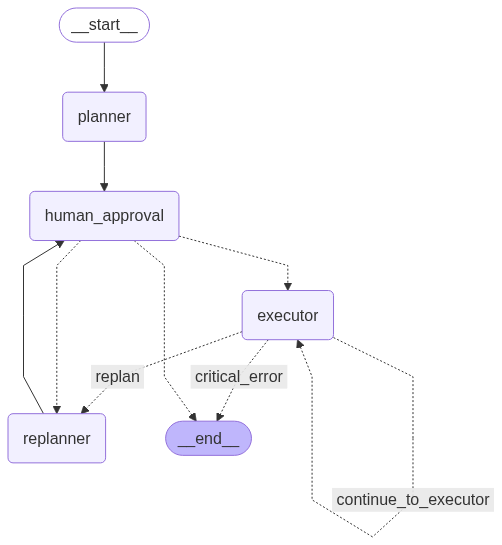

# Buddy AI Agent

Buddy AI is an intelligent agent built using [LangGraph](https://langchain-ai.github.io/langgraph/), designed to assist with system administration and software development tasks. It interprets user objectives, formulates plans, and executes them by interacting with the system environment.

## Core Functionality

Buddy AI employs a plan-and-execute architecture, cycling through stages of planning, user approval, execution, and replanning as needed. The core of its functionality is managed by several key nodes within its LangGraph structure:

*   **Planner:** This node is responsible for interpreting the user's objective and any provided context (files or directory contents). It generates an initial step-by-step plan, outlining the actions required to achieve the objective.
*   **Human Approval:** Before execution, the proposed plan is presented to the user. This node allows the user to:
    *   Approve the plan for execution.
    *   Request refinements if the plan is not satisfactory.
    *   Cancel the process if the plan is unachievable or incorrect.
*   **Executor:** Once a plan is approved, the executor takes over. It processes each step of the plan sequentially. For steps involving system interaction, it utilizes a `ShellTool` to run shell commands. This allows the agent to perform a wide range of tasks, such as file manipulation, code compilation, running scripts, and interacting with version control systems.
*   **Replanner:** If the user requests changes to the plan during the approval stage, or if the executor encounters errors or situations that necessitate a change in strategy, the replanner node is invoked. It takes the existing plan and user feedback (or execution results) to generate a revised plan.
*   **Deciders:** These are conditional logic nodes that control the flow of execution within the graph. Based on the outcome of previous nodes (e.g., plan approval status, execution success/failure), deciders route the process to the appropriate next step, such as proceeding with execution, moving to replanning, or terminating the workflow.

## Command-Line Usage

Buddy AI is run from the command line using the `buddy_ai.cli` module.

```bash
python -m buddy_ai.cli [arguments]
```

### Accepted Arguments:

*   `--prompt <string_or_filepath>`: **(Required)** This argument specifies the user's objective or the instructions for the agent. It can be provided as a direct string on the command line or as a path to a text file containing the objective.
*   `--context <filepath_or_directorypath>`: **(Optional)** This argument allows you to provide contextual information to the agent. You can specify a path to a single file or a directory. If a directory path is given, Buddy AI will recursively read all text-based files within that directory to use as context for planning.
*   `--auto`: **(Optional)** When this flag is present, it enables auto-mode. In auto-mode, the initial plan generated by the Planner is automatically approved, bypassing the Human Approval step. This is useful for trusted tasks or when running the agent in a non-interactive environment.

## Usage Examples

Here are a few examples of how to use Buddy AI:

```bash
# Example 1: Analyze the project, add a feature, test, and fix
python -m buddy_ai.cli --context . --prompt "Analyze this project, add an option to list files, create end-to-end tests for it, and run them. If they fail, fix the issues and try again."

# Example 2: Improve a Python script and run it
python -m buddy_ai.cli --context my_script.py --prompt "Improve the syntax of this Python script and then run it to ensure it works."

# Example 3: Create and compile a Go application
python -m buddy_ai.cli --prompt "Create a Go application that prints the content of https://google.com. Compile it and ensure it executes correctly."
```

## Application Structure

The Buddy AI project is organized as follows:

*   `buddy_ai/`: The main Python package directory.
    *   `agent.py`: Defines the LangGraph state machine, including nodes, edges, and conditional logic that constitute the core agent.
    *   `cli.py`: Provides the command-line interface for interacting with the agent. It handles argument parsing, loading configurations, and invoking the agent workflow.
    *   `nodes/`: This directory contains individual Python modules for each main node in the graph:
        *   `planner.py`: Logic for the Planner node.
        *   `human_approval.py`: Logic for the Human Approval node.
        *   `executor.py`: Logic for the Executor node.
        *   `replanner.py`: Logic for the Replanner node.
        *   `deciders.py`: Logic for conditional decider nodes.
    *   `shared_instances.py`: A module for managing globally shared objects, such as LLM instances and the Rich console, ensuring they are consistently accessed across the application.
    *   `config.py`: Responsible for loading application configurations, like API keys and model names, from the `config.ini` file.
    *   `utils.py`: Contains various utility functions used throughout the application.
*   `config.ini`: The configuration file where API keys for services like Google Generative AI and preferred model names are stored.
*   `requirements.txt`: A standard Python file listing all the dependencies required to run Buddy AI.
*   `setup.py`: The Python project setup script used for packaging and distribution.
*   `graph.png`: A visual representation of the agent's execution graph structure, showing the flow between different nodes.
*   `README.md`: This file, providing documentation for the Buddy AI agent.

## Execution Flow

The typical execution flow of the Buddy AI agent is as follows:

1.  **Initialization:** The `cli.py` script parses command-line arguments, loads configurations from `config.ini`, and initializes the necessary LLM instances.
2.  **Planning:** The process starts with the `planner` node. It takes the user's objective and any provided context to generate a multi-step plan.
3.  **Human Approval:** The generated plan is then passed to the `human_approval` node.
    *   If `--auto` mode is enabled, the plan is automatically approved.
    *   Otherwise, the user is prompted to review the plan. They can approve it, suggest refinements (which sends the process to the `replanner`), or cancel.
4.  **Execution:** If the plan is approved, it moves to the `executor` node.
    *   The `executor` processes each step of the plan. For tasks requiring system interaction, it uses a `ShellTool`.
    *   After each step (or a sequence of steps, depending on the plan's granularity), the `should_continue_decider` node is invoked.
5.  **Decision & Continuation:** The `should_continue_decider` evaluates the outcome of the executed step(s):
    *   If the step was successful and more steps remain, it routes back to the `executor` for the next step.
    *   If the objective is deemed achieved, the process moves to `END`.
    *   If an error occurs or the step's outcome suggests the current plan is no longer viable, it may route to the `replanner`.
    *   If a critical error occurs that cannot be recovered from, it also moves to `END`.
6.  **Replanning:** If the `replanner` node is invoked (either due to user feedback or executor issues):
    *   It revises the plan based on the new information.
    *   The revised plan is then sent back to the `human_approval` node to restart the review cycle.
7.  **Looping and Termination:** The agent continues to loop through the approval, execution, and replanning phases as necessary until the objective is successfully met or the process is explicitly cancelled or encounters a critical, unrecoverable error.

This flow is visually represented by the agent's graph structure:


